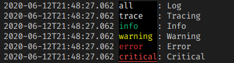

# extendedlogger
Some usefull extension for std.experimental.logger

## ExtendedFileLogger

A derived class from std.experimental.logger : FileLogger that allows to setup a pattern

An example:
```D
    auto logger = new ExtendedFileLogger("output.log", LogLevel.all, new ConfigurableLogPattern("%d %-8p: ));

    logger.info("A log event..."); // outputs : "2020-06-12T20:04:40.019 info    : A log event..."
    logger.warning("Danger!");     // outputs : "2020-06-12T20:04:50.019 warning : Danger!"
```

Like `FileLogger`, can accept an instance of `File` :
```D
    import std.stdio : stdout;
    auto logger = new ExtendedFileLogger(stdout, LogLevel.all, new ConfigurableLogPattern("%r %-8p: ));
    Thread.sleep( dur!("msecs")( 50 ) );

    logger.info("A log event..."); // outputs on console : "50 info    : A log event..."
```

`ExtendedFileLogger` can use any implementation of `ILogPattern`. The library includes two implementations : `SimpleLogPattern` and `ConfigurableLogPattern`

### SimpleLogPattern

`SimpleLogPattern` implements the same log pattern that the original `FileLogger` on a more eficient way 
that parsing a string pattern.

### ConfigurableLogPattern

`ConfigurableLogPattern` parses a string to build the log pattern. The actual implementation uses the GC and have many room to be improved.

The pattern format it's based of log4j pattern layout format. Each conversion specifier starts with a percent sign (%) and is followed by
optional format modifiers and a conversion character. The conversion character specifies the type of data, e.g. module, priority, date, 
thread name. The format modifiers control such things as field width, padding, left and right justification. An example would be `%d %-8p %m : ` 

The recognized conversion characters are :

| Conversion Character | Effect |
| -------------------- | ------ |
| m | Module name |
| d | Used to output the date of the logging event. Actually only outputs on ISO format |
| F | Used to output the file name where the logging request was issued. |
| L | Used to output the line number from where the logging request was issued. | 
| M | Used to output the function or method name where the logging request was issued. |
| p | Used to output the priority of the logging event. |
| r | Used to output number of milliseconds elapsed from the construction of this logger until the logging event. |
| t | Used to output the thread that generated the logging event. |

The optional format modifier is placed between the percent sign and the conversion character.

The first optional format modifier is the left justification flag which is just the minus (-) character. Then comes the optional minimum field width modifier. This is a decimal constant that represents the minimum number of characters to output. If the data item requires fewer characters, it is padded on either the left or the right until the minimum width is reached. The default is to pad on the left (right justify) but you can specify right padding with the left justification flag. The padding character is space. If the data item is larger than the minimum field width, the field is expanded to accommodate the data. The value is never truncated.

This behavior can be changed using the maximum field width modifier which is designated by a period followed by a decimal constant. If the data item is longer than the maximum field, then the extra characters are removed from the beginning of the data item and not from the end. For example, it the maximum field width is eight and the data item is ten characters long, then the first two characters of the data item are dropped. This behavior deviates from the printf function in C where truncation is done from the end.

Below are various format modifier examples for the category conversion specifier.

| Format modifier | left justify | minimum width | maximum width | comment |
| --------------- | ------------ | ------------- | ------------- | ------- | 
| %20m            | false        | 20            | none          | Left pad with spaces if the module name is less than 20 characters long.
| %-20m           | true         | 20            | none          | Right pad with spaces if the module name is less than 20 characters long.
| %.30m           |	NA           | none          | 30            | Truncate from the beginning if the module name is longer than 30 characters.
| %20.30m         | false        | 20            | 30            | Left pad with spaces if the module name is shorter than 20 characters. However, if module name is longer than 30 characters, then truncate from the beginning.
| %-20.30m        | true         | 20            | 30            | Right pad with spaces if the module name is shorter than 20 characters. However, if module name is longer than 30 characters, then truncate from the beginning.

A default simple pattern format it's included, `simplePattern`. This pattern it's `%d %-8p: `, and it 
would output the date on ISO format, followed for the priority level right padded to 8 spaces and separating from the message with a ": ".

## ConsoleLogger

`ConsoleLogger` extends over `ExtendedFileLogger` using stdout as output. Also, uses by default 
the `ConfigurableAnsiLogPattern` log pattern, that colorizes the priority with ANSI escape sequences.

An example :
```D
    auto logger = new ConsoleLogger(LogLevel.info);
    logger.log("Log");
    logger.trace("Tracing");
    logger.info("Info");
    logger.warning("warn");
    logger.error("error");
    logger.critical("critical")
```
Generates this output :



